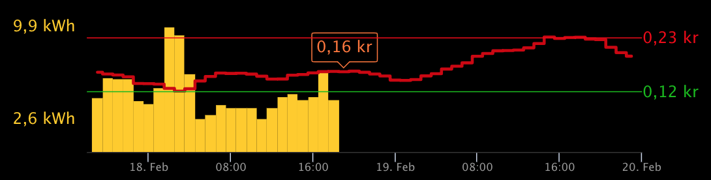
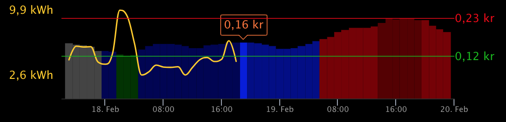

# MMM Tibber

Module for [MagicMirror](https://github.com/MichMich/MagicMirror/) showing electricity price data from Tibber.

You can see the price per hour for today and tomorrow, and historical consumption.

## Screenshot





## Installation

Go to your `MagicMirror/modules` folder and write

    git clone https://github.com/ottopaulsen/MMM-Tibber
    cd MMM-Tibber
    npm install

## Configuration

Here is an example configuration. Put it in the `MagicMirror/config/config.js` file:

```javascript
{
    module: 'MMM-Tibber',
    position: 'bottom_center',
    config: {
        tibberToken: '<find your token from tibber.com>'
    }
},
```

Of course, you need a [Tibber](https://tibber.com/) account to use this module. Your access token (`tibberToken`) can be found in the [developer pages](https://developer.tibber.com/settings/accesstoken).

If you have more than one Tibber subscription (for example several houses), you must use the houseNumber config variable to set correct house number. You can turn on logging (`logging: true`) and watch the output from the node_helper in the terminal window to check the address of the configured house.

The above is the minimum configuration required. Here is the complete module configuration you can use, with default values:

```javascript
config: {
    // General
    tibberToken: "log in to tibber to find your token",
    houseNumber: 0, // If you have more than one Tibber subscription
    logging: false,
    historyHours: 24,
    futureHours: 48,
    // Chart
    xAxisLineColor: "#333333",
    xAxisLabelColor: "#999999",
    adjustMargins: {
      left: 0,
      right: 0,
      top: 0
    },
    // Price curve
    showPrice: true,
    priceChartType: "line", // column, line or spline
    priceLineWidth: 3, // For line and spline, not column
    priceColor: "#cc0000", // For line and spline
    priceColumnColors: {
      // Only for column chart type
      NORMAL: ["#000055", "#0000dd", "#000088"], // Blue
      VERY_CHEAP: ["#004400", "#00dd00", "#008800"], // Lighter green
      CHEAP: ["#003300", "#00bb00", "#006600"], // Green
      EXPENSIVE: ["#440000", "#cc0000", "#770000"], // Red
      VERY_EXPENSIVE: ["#440000", "#aa0000", "#550000"], // Darker red
      UNKNOWN: ["#444444", "#444444", "#444444"] // Gray
    },
    // Consumption curve
    showConsumption: true,
    consumptionChartType: "column", // column, line or spline
    consumptionLineWidth: 2, // For line and spline
    consumptionColor: "#ffcc00", // For line and spline
    consumptionDecimals: 1,
    // Price label and min/max price text
    priceUnit: "kr",
    decimalSeparator: ",",
    priceFontSize: 16,
    priceDecimals: 2,
    showCurrentPrice: true,
    curPriceColor: "#ff7733",
    // Min and Max price lines
    showMinPrice: true,
    showMaxPrice: true,
    minPriceLineWidth: 1,
    maxPriceLineWidth: 1,
    minPriceColor: "#00bb00",
    maxPriceColor: "#ee0000",
    adjustPriceLabelsX: 0, // Adjust position sideways in pixels (pos or neg)
    // Min/Max consumption labels
    showMinConsumption: true,
    showMaxConsumption: true,
    adjustConsumptionLabelsX: 0 // Adjust position sideways in pixels (pos or neg)
}
```

The `futureHours` max value is 48, but it cannot show more than the whole next day. Also, the next day is not available until some time during the day.

<hr/>

Here are my other [modules for MagicMirror](https://github.com/ottopaulsen/magic).
