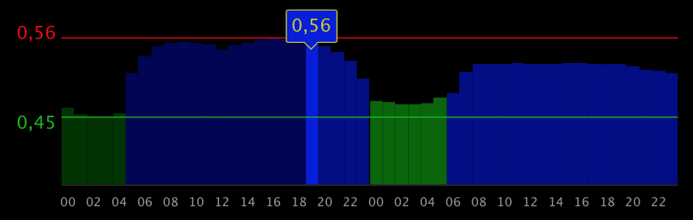

# MMM Tibber

Show electricity price data from Tibber.

Yo can see the price per hour for today and tomorrow.

## Screenshot




## Installation

Go to your `MagicMirror/modules` folder and write

    git clone https://github.com/ottopaulsen/MMM-Tibber
    cd MMM-Tibber
    npm install


## Configuration

Here is an example configuration. Put it in the `MagicMirror/config/config.js` file:

``` javascript
{
    module: 'MMM-Tibber',
    position: 'bottom_left',
    config: {
        tibberToken: '<find your token from tibber.com>',
    }
},
```

The above is the minimum configuration required. Here is the complete configuration you can use, with default values:

``` javascript
{
    module: 'MMM-Tibber',
    position: 'bottom_left',
    config: {
        tibberToken: '<find your token from tibber.com>',
        logging: false,
        decimalSeparator: ",",
        priceFontSize: 16,
        showMinPrice: true,
        showMaxPrice: true,
        showCurrentPrice: true,
        minPriceX: -40,
        minPriceY: 10,
        maxPriceX: -40,
        maxPriceY: 0,
        minPriceLineWidth: 1,
        maxPriceLineWidth: 1,
        minPriceColor: "#00bb00",
        curPriceColor: "#cccc00",
        maxPriceColor: "#ee0000",
        xAxisLineColor: "#333333",
        xAxisLabelColor: "#999999",
        historyHours: 24,
        futureHours: 48,
        columnColors: {
            'NORMAL': ['#000055', '#0000dd', '#000088'], // Blue
            'CHEAP': ['#003300', '#00bb00', '#006600'], // Green
            'EXPENSIVE': ['#440000', '#cc0000', '#770000'] // Red
        }
    }
},
```

The `historyHours` max value is 24. However, you cannot show more history than back to midnight. Similarly, the `futureHours` max value is 48, but it cannot show more than the whole next day.

<hr/>

Here are my other [modules for MagicMirror](https://github.com/ottopaulsen/magic).

